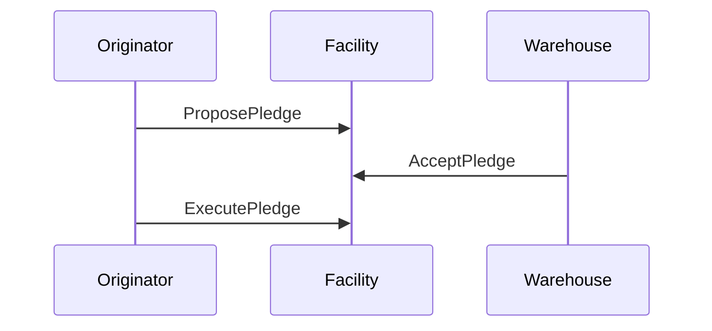
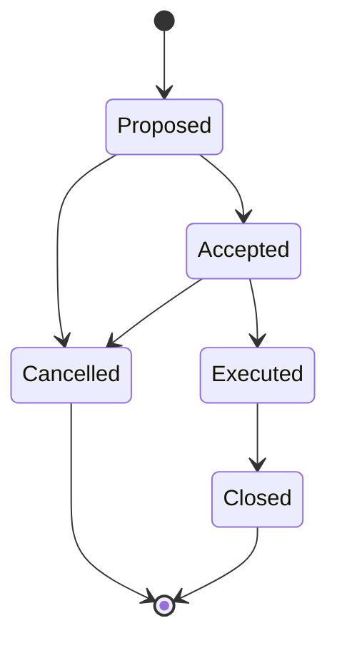

# Warehouse Facility Smart Contact

This a CosmWasm smart contract that provides a warehouse facility between a loan originator and a warehouse provider. Each new facility agreement requires a new instantiation of the smart contract on Provenance.

## Pledge Process

### Typical Flow



### Pledge State Diagram



## Concepts

### Asset Pool Marker

An asset pool marker is a marker that represents ownership and encumberance of a pool of assets. In the case of a warehouse facility, the assets are loans. The facility smart contract will create an asset pool marker when the assets are proposed to the facility.

### Facility Marker

A facility marker is a marker that represents fractional ownership of the pool of assets currently encumbered in a warehouse facility. The facility marker is created and credited to the orginator and warehouse accounts when the facility is instantiated, based on the advance rate set in the facility terms.

## Summary

### Instantiate

By instantiating the smart contract, a new facility is created representing an agreement between the originator and the warehouse.

```json
{
    "bind_name": "warehouse-facility.sc.pb",
    "contract_name": "warehouse_facility",
    "facility": {
        "originator": "<Originator Account Address>",
        "warehouse": "<Warehouse Account Address>",
        "marker_denom": "<Facility Marker Denom>",
        "stablecoin_denom": "<Stablecoin Denom>",
        "advance_rate": "<Advance Rate>"
    }
}
```

### Transactions

**ProposePledge**

This function is used by the originator to propose that asset(s) be added to the warehouse facility in exchange for credit. Upon completion of this transaction, the asset(s) included in the proposal will be escrowed by transferring the asset marker(s) from the originator to the facility account.

```/todo```

**AcceptPledge**

This function is used by the warehouse provider to accept the terms of a pledge proposal. Upon completion of this transaction, the requested credit will be escrowed by transferring the stablecoin from the warehouse provider to the facility account.

```/todo```

**CancelPledge**

This function is used by the originator to cancel a pledge proposal.

In the case where the pledge is cancelled *before* acceptance by the warehouse provider, then the involved asset(s) are removed from escrow by transferring the asset marker(s) from the facility account back to the originator.

In the case where the pledge is cancelled *after* acceptance by the warehouse provider, then the escrowed credit will be removed from escrow by transferring the stablecoin from the facility account back to the warehouse provider. The escrowed asset( marker(s) will additionally be handled as mentioned above.

```/todo```

**ExecutePledge**

This function is used by the originator to execute a pledge that has been accepted by the warehouse provider. Upon completion of this transaction:

1. The stablecoin escrowed by the warehouse provider will be transferred to the originator.
2. An attribute indicating encumberance in the facility will be added to the asset marker(s) involved in the pledge.
3. The facility marker(s) will be minted and distributed accordingly (how? -- examples?).

```/todo```

### Queries

**GetContractInfo**

*Description*
This query will return the contract information for an instance of the contract on Provenance.

*Parameters*
None

**GetFacilityInfo**

*Description*
This query will return the facility information, including the warehouse and originator addresses, the facility marker denom and the stablecoin denom, and the advance rate of the facility.

*Parameters*
None

**GetPledge**

*Description*
This query will return the current state of a pledge given the pledge identifier.

*Parameters*
```json
{
    "id": "<Pledge UUID>"
}
```

**ListPledgeIds**

*Description*
This query will return a list of the identifiers for every pledge in the facility.

*Parameters*
None

**ListPledges**

*Description*
This query will return a list of the current state for every pledge in the facility.

*Parameters*
None

## Building the Contract

To compile the smart contract WASM, run the `make` command:

```sh
$ make
```


## Example Usage

### Preconfigure

**Accounts**

| Account Name      | Description                            | Example Address                             |
| ----------------- | -------------------------------------- | ------------------------------------------- |
| portfolio_manager | Portfolio manager.                     | `tp15mdpkyfeudupfl2zwsmmk9xeley0evv78nx9ua` |
| originator        | The loan asset originator.             | `tp1946qs4fzcf2v9tslx50rl7dgk0tyj7p5sf8jm0` |
| warehouse         | The warehouse provider.                | `tp1c8h8fc0pm4c6cnthleeykyv0mgk74t4afnc3vw` |

**Markers**

| Marker Denom | Description               |
| ------------ | ------------------------- |
| nhash        | Provenance utility token. |
| omni.usd     | Stablecoin.               |

**Contracts**

| Contract           | Description                                | Example Address                             |
| ------------------ | ------------------------------------------ | ------------------------------------------- |
| Warehouse Facility | Facility between originator and warehouse. | `tp18vd8fpwxzck93qlwghaj6arh4p7c5n89x8kskz` |

### Store WASM

```sh
$ provenanced tx wasm store artifacts/warehouse_facility.wasm \
    --source https://github.com/provenance-io/warehouse-facility \
    --builder cosmwasm/rust-optimizer:0.10.7 \
    --broadcast-mode block \
    --chain-id chain-local \
    --fees 40000nhash \
    --gas 5000000 \
    --gas-adjustment 1.4 \
    --keyring-backend test \
    --from node0 \
    --testnet \
    --yes
```

### Instantiation

Create the facility between the originator and the warehouse with an advance rate of `75.125%` under the facility marker `pb.fm.1`.

```sh
$ provenanced tx wasm instantiate 1 \
    '{"bind_name":"warehouse-facility.sc.pb","contract_name":"warehouse_facility","facility":{"marker_denom":"pb.fm.1","stablecoin_denom":"omni.usd","advance_rate":"75.125","originator":"tp1946qs4fzcf2v9tslx50rl7dgk0tyj7p5sf8jm0","warehouse":"tp1c8h8fc0pm4c6cnthleeykyv0mgk74t4afnc3vw"}}' \
    --label warehouse-facility \
    --admin tp15mdpkyfeudupfl2zwsmmk9xeley0evv78nx9ua \
    --broadcast-mode block \
    --chain-id chain-local \
    --fees 40000nhash \
    --gas 5000000 \
    --gas-adjustment 1.4 \
    --keyring-backend test \
    --from node0 \
    --testnet \
    --yes
```

### Proposing a Pledge

Propose a pledge `e1132c9d-039e-48fa-b177-c9855d380e8d` from the originator which includes two assets (`da7063ea-2995-4d11-b2fc-43ff3f3542c6` and `b071911f-78a2-410c-854d-f15231cb3cc7`) with a total value of `$390,000.00` for an advance of `$292,987.50` under the asset marker `pm.pool.op1`:

```sh
$ provenanced tx wasm execute tp18vd8fpwxzck93qlwghaj6arh4p7c5n89x8kskz \
    '{"propose_pledge":{"assets":[{"id":"da7063ea-2995-4d11-b2fc-43ff3f3542c6","value":12000000},{"id":"b071911f-78a2-410c-854d-f15231cb3cc7","value":27000000}],"id":"e1132c9d-039e-48fa-b177-c9855d380e8d","total_advance":29298750,"asset_marker_denom":"pm.pool.op1"}}' \
    --broadcast-mode block \
    --chain-id chain-local \
    --fees 40000nhash \
    --gas 5000000 \
    --gas-adjustment 1.4 \
    --keyring-backend test \
    --from originator \
    --testnet \
    --yes
```

### Accepting the pledge

Accept the pledge `e1132c9d-039e-48fa-b177-c9855d380e8d` from the warehouse, including the advance of `29298750 omni.usd` stablecoin with the transaction:

```sh
$ provenanced tx wasm execute tp18vd8fpwxzck93qlwghaj6arh4p7c5n89x8kskz \
    '{"accept_pledge":{"id":"e1132c9d-039e-48fa-b177-c9855d380e8d"}}' \
    --amount 29298750omni.usd \
    --broadcast-mode block \
    --chain-id chain-local \
    --fees 40000nhash \
    --gas 5000000 \
    --gas-adjustment 1.4 \
    --keyring-backend test \
    --from warehouse \
    --testnet \
    --yes
```

### Executing the pledge

Execute the pledge `e1132c9d-039e-48fa-b177-c9855d380e8d` from the originator:

```sh
$ provenanced tx wasm execute tp18vd8fpwxzck93qlwghaj6arh4p7c5n89x8kskz \
    '{"execute_pledge":{"id":"e1132c9d-039e-48fa-b177-c9855d380e8d"}}' \
    --broadcast-mode block \
    --chain-id chain-local \
    --fees 40000nhash \
    --gas 5000000 \
    --gas-adjustment 1.4 \
    --keyring-backend test \
    --from originator \
    --testnet \
    --yes
```